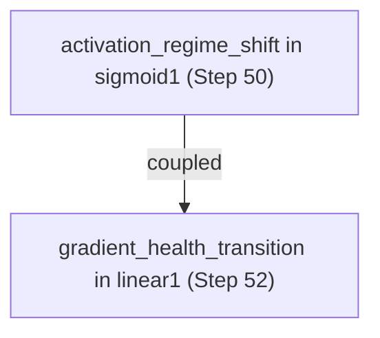

# NeuralDbg Inference Flow

This document outlines the causal reasoning process within the NeuralDbg engine, from raw data extraction to hypothesis generation.

## 1. Data Extraction (The Probes)

NeuralDbg uses PyTorch hooks to capture data without duplicating tensors in memory. We focus on two primary channels:
- **Forward Pass**: Activation statistics (mean, std, sparsity, dead_ratio, saturation_ratio).
- **Backward Pass**: Gradient norms (to detect vanishing/exploding signals).

### Compiler-Awareness
Hooks are wrapped with `@dynamo_disable` to ensure they persist when using `torch.compile`. We recommend wrapping the model *before* compilation.

## 2. Semantic Event Engine

Raw statistics are converted into **Semantic Events**. This compression (typically 10,000x) ensures we only store meaningful transitions:
- **Gradient Transitions**: Healthy -> Vanishing, Exploding, or Saturated.
- **Activation Shifts**: Normal -> Dead, Saturated, or Anomalous.

### Health Classification
- **Dead Neurons**: `dead_ratio > 0.9` (usually due to ReLU "dying" from large negative bias).
- **Saturation**: `saturation_ratio > 0.7` (Sigmoid/Tanh pushed to extreme plateaus).
- **Vanishing**: Norm below the configured `threshold_vanishing`.

## 3. Causal Reasoning Algorithm

Once events are captured, the engine applies three reasoning layers:

### Layer A: First-Occurrence Tracking
The engine marks the first step and layer where a failure appeared. Causal logic assumes that the *earliest* failure in the graph is often the root cause.

### Layer B: Temporal Coupling
The engine looks for temporal windows where an activation shift is followed by a gradient transition.
- *Example*: Saturation in `sigmoid_4` at Step 100 -> Vanishing in `linear_3` at Step 102.
- *Hypothesis*: The saturation caused the vanishing gradient (Gradient = Weight * Activation_Derivative, and Sigmoid derivative is near 0 when saturated).

### Layer C: Pattern Matching
Predefined templates (e.g., "Exploding Gradients", "Vanish via Saturation") are matched against the captured events to generate human-readable hypotheses.

## 4. Output: Ranked Hypotheses

The engine outputs a list of `CausalHypothesis` objects, ranked by confidence. Confidence is derived from:
- Metadata magnitude (how severe was the explosion?).
- Temporal proximity (how close were the coupled events?).
- State stability (did the failure persist?).

## 5. Visualization (Mermaid)

The engine can export a causal graph in Mermaid format, showing:
- **Temporal Edges**: Sequence of failures in the same layer.
- **Causal Edges**: Potential influence between different layers.

