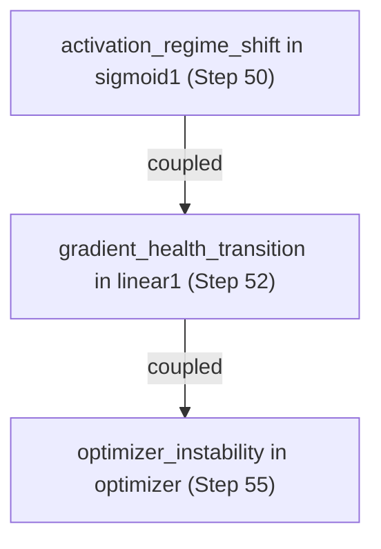

# NeuralDbg Inference Flow

This document outlines the causal reasoning process within the NeuralDbg engine, from raw data extraction to hypothesis generation.

## 1. Data Extraction (The Probes)

NeuralDbg uses PyTorch hooks to capture data without duplicating tensors in memory. We focus on three primary channels:
- **Forward Pass (Activations)**: Activation statistics (mean, std, sparsity, dead_ratio, saturation_ratio).
- **Forward Pass (Inputs)**: Data anomaly detection (NaN, Inf, distribution shift) on layer inputs.
- **Backward Pass (Gradients)**: Gradient norms (to detect vanishing/exploding signals).

Additionally, the user can feed loss values via `record_loss()` to enable optimizer instability detection.

### Compiler-Awareness
Hooks are wrapped with `@dynamo_disable` to ensure they persist when using `torch.compile`. We recommend wrapping the model *before* compilation.

### Performance Optimization
Layer names are resolved via a pre-computed `id(module) -> name` dictionary built at initialization time. This gives O(1) lookup per hook call instead of O(n) scanning through `named_modules()`.

## 2. Semantic Event Engine

Raw statistics are converted into **Semantic Events**. This compression (typically 10,000x) ensures we only store meaningful transitions:

### Event Types

| Event Type | Source | What It Detects |
|------------|--------|-----------------|
| `gradient_health_transition` | Backward hooks | Healthy -> Vanishing, Exploding, or Saturated |
| `activation_regime_shift` | Forward hooks | Normal -> Dead, Saturated, or Anomalous |
| `optimizer_instability` | `record_loss()` | Stable -> Loss Plateau, Loss Spike, or Diverging |
| `data_anomaly` | Forward hooks (inputs) | Normal -> NaN Detected, Inf Detected, or Distribution Shift |

### Health Classification Thresholds

**Gradient Health**:
- **Vanishing**: Norm below `threshold_vanishing` (default: 1e-6).
- **Exploding**: Norm above `threshold_exploding` (default: 1e3).
- **Saturated**: Norm between `threshold_vanishing` and `threshold_vanishing * 100` (persistent small gradient flow).
- **Healthy**: Everything else.

**Activation Health**:
- **Dead Neurons**: `dead_ratio > 0.9` (usually due to ReLU "dying" from large negative bias).
- **Saturation**: `saturation_ratio > 0.7` (Sigmoid/Tanh pushed to extreme plateaus).
- **Anomalous**: `std < 1e-4` (activations collapsed to near-constant values).

**Optimizer Health**:
- **Loss Plateau**: Standard deviation of recent 5 losses is < 0.01% of mean (training stuck).
- **Loss Spike**: Latest loss > 10x the mean of previous 5 losses (sudden destabilization).
- **Diverging**: NaN or Inf in recent loss values (numerical breakdown).

**Data Health**:
- **NaN Detected**: Any NaN value in the input tensor.
- **Inf Detected**: Any Inf value in the input tensor.
- **Distribution Shift**: Input mean shifted by > 3 sigma OR input std changed by > 5x compared to previous observation.

## 3. Causal Reasoning Algorithm

Once events are captured, the engine applies four reasoning layers:

### Layer A: First-Occurrence Tracking
The engine marks the first step and layer where a failure appeared. Causal logic assumes that the *earliest* failure in the graph is often the root cause. This is stored in `first_failure_step` and `first_failure_layer` dictionaries keyed by failure type.

### Layer B: Temporal Coupling
The engine looks for temporal windows (default: 5 steps) where events in different layers occur in sequence.
- *Example*: Saturation in `sigmoid_4` at Step 100 -> Vanishing in `linear_3` at Step 102.
- *Hypothesis*: The saturation caused the vanishing gradient (Gradient = Weight * Activation_Derivative, and Sigmoid derivative is near 0 when saturated).
- Known patterns (e.g., activation shift followed by gradient transition) receive a confidence boost of +0.2.

### Layer C: Cross-Domain Correlation
The engine correlates events across different domains:
- **Gradient explosion -> Loss spike/divergence**: If an exploding gradient event precedes a loss spike, the engine generates a cross-referenced hypothesis with boosted confidence.
- **Data anomaly -> Gradient instability**: NaN/Inf in inputs propagating to gradient problems.
- **Activation saturation -> Gradient vanishing**: The classic coupling where saturated activations kill gradient flow.

### Layer D: Pattern Matching
Predefined templates (e.g., "Exploding Gradients", "Vanish via Saturation", "Loss Plateau", "Data Corruption") are matched against the captured events to generate human-readable hypotheses.

## 4. Event Compression

The `_collapse_events()` method merges sequential events in the same layer into summary traces:

```text
Before: HEALTHY -> SATURATED (step 10) + SATURATED -> VANISHING (step 20)
After:  HEALTHY -> VANISHING (step 10, collapsed_count=2, step_range="10-20")
```

Rules:
- Only events with the **same layer AND same event type** are candidates for collapsing.
- If the chain **reverts** (A -> B -> A), events are kept individually (no information loss).
- The collapsed event uses the **maximum confidence** from the chain.
- Metadata includes `collapsed_count` and `step_range` for traceability.

## 5. Output: Ranked Hypotheses

The engine outputs a list of `CausalHypothesis` objects, ranked by confidence. Each hypothesis contains:
- **description**: Human-readable explanation of the failure cause.
- **confidence**: Float between 0.0 and 1.0.
- **evidence**: List of `SemanticEvent` objects supporting the hypothesis.
- **causal_chain**: List of strings describing the causal sequence.

Confidence is derived from:
- Metadata magnitude (how severe was the explosion?).
- Temporal proximity (how close were the coupled events?).
- State stability (did the failure persist?).
- Cross-domain correlation (did multiple failure types align?).

### Supported Failure Types

| Failure Type | Method | What It Explains |
|--------------|--------|------------------|
| `vanishing_gradients` | `_explain_vanishing_gradients()` | Root cause + saturation coupling |
| `exploding_gradients` | `_explain_exploding_gradients()` | First layer to explode |
| `dead_neurons` | `_explain_dead_neurons()` | Neuron death in activation layers |
| `saturated_activations` | `_explain_saturated_activations()` | Activation saturation patterns |
| `optimizer_instability` | `_explain_optimizer_instability()` | Loss plateaus, spikes, divergence + gradient cross-ref |
| `data_anomaly` | `_explain_data_anomaly()` | NaN/Inf/distribution shift in inputs |

## 6. Visualization (Mermaid)

The engine can export a causal graph in Mermaid format, showing:
- **Temporal Edges**: Sequence of failures in the same layer.
- **Causal Edges**: Potential influence between different layers (coupled failures).



## 7. API Summary

```python
# Context manager for automatic hook management
with NeuralDbg(model) as dbg:
    # Training loop
    for step in range(num_steps):
        dbg.step = step
        output = model(inputs)
        loss = criterion(output, targets)
        loss.backward()
        dbg.record_loss(loss.item())  # Optimizer instability tracking
        optimizer.step()

# Post-mortem analysis
hypotheses = dbg.explain_failure("vanishing_gradients")
couplings = dbg.detect_coupled_failures()
collapsed = dbg._collapse_events()
mermaid = dbg.export_mermaid_causal_graph()
```
