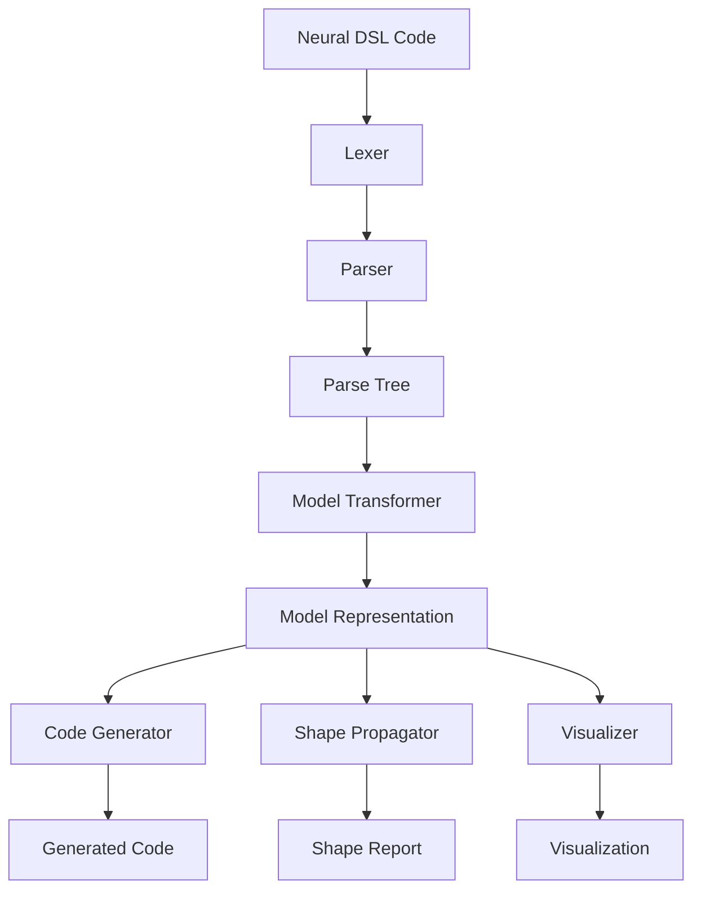

# Neural Documentation Images

This directory contains images used in the Neural documentation.

## Diagram Images

- `parser_diagram.png`: Diagram of the Neural DSL parser architecture
- `code_generation_flow.png`: Diagram of the code generation workflow
- `shape_propagation.png`: Diagram of the shape propagation process
- `visualization_example.png`: Example of a Neural visualization
- `dashboard_overview.png`: Overview of the NeuralDbg dashboard
- `hpo_workflow.png`: Diagram of the hyperparameter optimization workflow
- `cli_diagram.png`: Diagram of the CLI architecture
- `neuralpaper_architecture.png`: Diagram of the NeuralPaper.ai architecture
- `profiler_workflow.png`: Diagram of the profiler workflow
- `profiling_methodology.png`: Diagram of the profiling methodology
- `documentation_structure.png`: Diagram of the documentation structure
- `examples_overview.png`: Overview of the Neural examples
- `testing_pyramid.png`: Diagram of the testing pyramid

## Creating Diagrams

These diagrams can be created using tools like:

- [Draw.io](https://draw.io)
- [Lucidchart](https://www.lucidchart.com)
- [Mermaid](https://mermaid-js.github.io/mermaid/#/)
- [PlantUML](https://plantuml.com/)

## Guidelines for Diagrams

When creating diagrams, follow these guidelines:

1. **Consistency**: Use consistent colors, shapes, and styles across diagrams
2. **Simplicity**: Keep diagrams simple and focused on the main concepts
3. **Readability**: Use clear labels and appropriate font sizes
4. **Accessibility**: Ensure sufficient color contrast for readability
5. **Resolution**: Use high-resolution images (at least 600px wide)
6. **Format**: Use PNG format for diagrams

## Example Mermaid Diagram

Here's an example of a Mermaid diagram for the parser architecture:

This can be rendered using the Mermaid CLI or online tools like the [Mermaid Live Editor](https://mermaid-js.github.io/mermaid-live-editor/).
